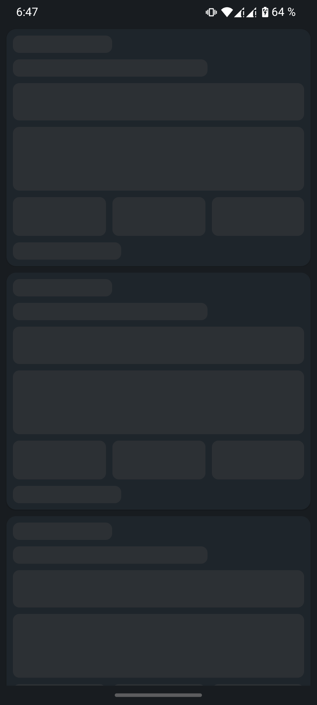
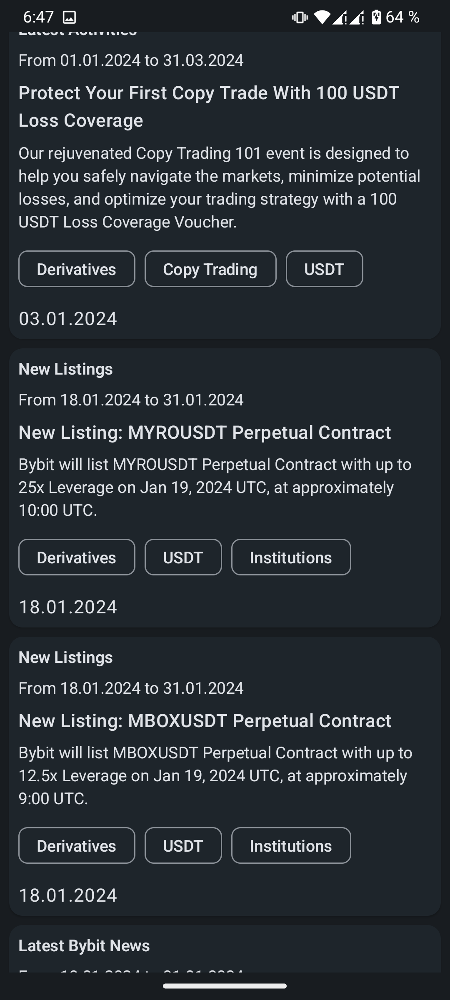
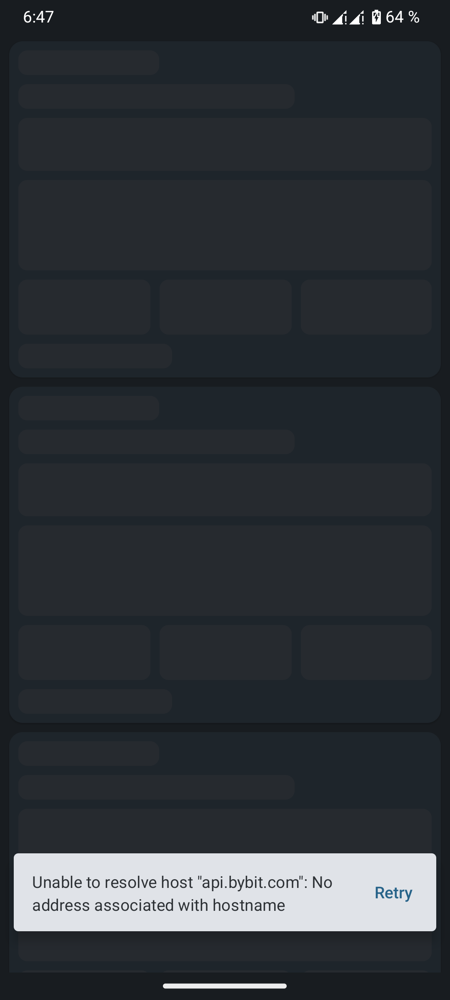

# Тестовое задание
Приложение загружает данные с сервера и отображает в виде списка на экране.
Используется архитектура Model-View-ViewModel.
Данные загружаются в слое *data*, оттуда поступают во ViewModel (слой *presentation*) и обрабатываются
при помощи UseCase в слое *domain*. ViewModel получает доступ к репозиторию (*data*) через интерфейсы
из слоя *api* посредством DI.
UI получает обновление состояния из ViewModel при помощи StateFlow
   

## Используемые библиотеки
- Язык программирования Kotlin 1.9.0
- Android Gradle Plugin 8.4.0-alpha04

Библиотеки:
- *Ktor 2.3.7* - используется для HTTP-запросов.
- *KotlinX Coroutines* - используется для асинхронного выполенения функций (чтобы не блокировать поток UI)
- *KotlinX Serialization* - сериалицазция/десериализация данных в формате JSON.
- *Koin* - используется для инъекции зависимостей(DI) в приложении
- *Jetpack Compose* - используется для вёрстки интерфейса пользователя.
- *AndroidX ViewModel* - используется для ViewModel в слое *presentation*.
- *Compose Material 3* - виджеты (composables) для *Jetpack Compose*, выполненные согласно спецификациям Google Material 3.